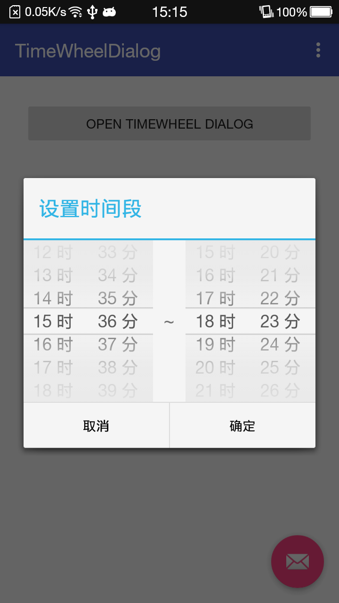
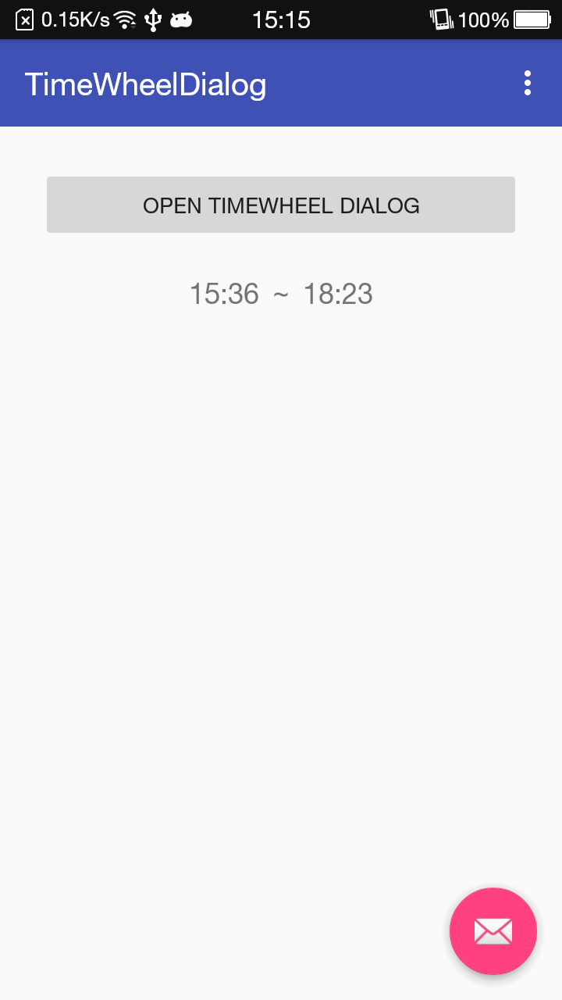

## TimeWheel
####TimeWheel Dialog to set the time period

| Set Time   | Done  |
|:----------:| :-----:|
|||

###Add the dependency
##### step 1
```gradle
allprojects {
	repositories {
		...
		maven { url "https://www.jitpack.io" }
	}
}
```
##### step 2
```gradle
compile 'com.github.yunTerry:TimeWheel:v2.1.0'
```

####Get the time period you set
```java
timebtn.setOnClickListener(new View.OnClickListener() {
            @Override
            public void onClick(View v) {
                new TimeWheel(MainActivity.this, new TimeListener() {
                    @Override
                    public void getTime(int[] time) {
                        //time[0]  start hour
                        //time[1]  start minute
                        //time[2]  endhour
                        //time[3]  end minute
                        timetv.setText(getTimeStr(time));
                    }
                });
            }
        });
```
##Thanks
####https://github.com/maarek/android-wheel
